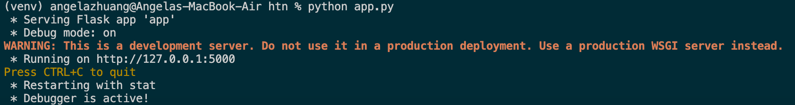

# Hack the North Backend Challenge Submission

This project acts as a submission to my application to be on Hack The North's 2025 Organizing team.

---

## API Description

This REST API backend is written with Python and Flask, with a database created with SQLite (and SQLAlchemy ORM). It acts as a server that would store and work with the HTN user data. The database currently holds two connected tables: the first contains all hackers' main data, while the second includes the scans with individual activities occurring during the hackathon.

### Endpoint Features

The API can handle direct HTTP requests to:

- Output all hackers' data - including name, email, phone, badge_code, and information on scans
- Output the listed data for one specified hacker
- Update subsets of the database fields with valid information
- Add scans (complete with name, category, and time scanned), to the "scans" table with unique combinations of hacker badge codes and activity names
- Output aggregate data about the scans for each activity, with optional query parameters to filter results

In addition to these required features, I decided to include simple endpoints to **create** and **delete** hackers from the database, as I believe this could be useful during the hackathon if singular requests must be made to update a participant's inclusion status. The API can thus:

- Write to the "hacker" table with a new hacker's information
- Remove a hacker from the table, should circumstances need it (e.g. badge was lost or no longer works)

---

## Assumptions

- badge codes cannot be duplicated, nor can they be NULL: there were 5 such users in the example_data.json file that had null badge codes

---

## Important Decisions

- Splitting each endpoint into individual functions, regardless of them being in the same route
  Endpoints all in the same main file, app.py, to ensure cohesiveness
- adding, with datetime, a function that prints in the exact format of the given dataset (SQL default time does not record milliseconds)
- in my database, is one table enough or am i doing multiple tables or just one - and then how am i ordering the database? order might be faster but not necessarily (since theres many fields, i might try to order it on specific keys), which case
  think about the wyas i would use the fdatabase
  what types of data points do i add key
  e.g. how many people attended the coffee chat/specific event today? go see how many people (searching off of something that might not usually be a key)

considerations: for the searching the database, might be able to just search the entire massive big database if the users are small enough, just 1000 participants can be fast enough for the program

- but since doing a lot of looping and searching individually, i can make another sql database table with the number of activities to enable functionality like ensuring only 1 mignight snack event per person and checking if the person's id name or email is alreday on the event in the activities table, which has individual activity ids for a reason
- also good for if the hackathon wants to expand or if the users are scanning 4390439 times
- questions i needed to consider: what happens when given an invalid user for update, delete, or get_hacker? would i let the sql error occur, or would i need to create a testcase for that and ouput my own custom error message?

- in my update_users function for the updating endpoint, i needed to check if a change was made and whether it was valid in the fields where ids needed to be unique, and if they were not NULL, and then change only them, in the end there are only 6 fields, 4 of which were changeable (scans would be changed in a different function, and updated_at would be automatically changed only if another field was updated)

- i started by making the main identifier for each hacker to be a number, incremented by 1 for each additional hacker, but that was just unnecessary information, so i opted to use badge_codes, as they would be unique and could probably send the most information for future functionality

- while i could have chosen to close the connection and not update any of the fields requested after finding that email is invalid, i chose to proceed only by not updating email and assuming that the other information was correct. this is so that each of the other fields (phone, name) could be updated immediately after so i would not have to store a list of commands i would later give to the sql connection

- reqriting functions like get_exact_time in each file because very short and did not need a separate file for it, also do not need to import it every time, but cannotn import from one file (e.g. i did that with script.py into app.py but when running app.py, it would import script.py, exiting and forcing the app.py to have script.py's functionality)
-
- for scans, i am creating a composite key so that the unique identifier activity_name can be scanned multiple times, given that it is not with a badge_code that has been scanned for that activity before.

- output of the get all hackers function puts the scnas in a list, which could not be formatted otherwise

- decided to manually select the parts of scans that are to be outputted to fit the user information
- do not have to add a scans section for a new created hacker, will automatically be done when a scan is actually made
- however, the big json file includes the scans, sort of an initializing scan as if they just checked into the event
- due to my time constraints, i chose not to validate all user inputs, like how i assumed that min_frequency is an integer less than or equal to max_frequency, or that user emails and phones had correct characters (e.g. @gmail.com) - this is also not very important, as data intake software such as Google Forms would also be able to check if dates and emails/URLs are correct
- before in the testing, trying to add a hacker that was already added would give me the error, sqlite3.IntegrityError: UNIQUE constraint failed: hackers.badge_code, after which all other commands would have resulted in an error ending with "sqlite3.OperationalError: database is locked"

---

## Setup Instructions:

Here's how you can set up my API in the same environment I used to develop it:

1. Set up the Python virtual environment for use on a local machine

   `python3 -m venv venv`

   `source venv/bin/activate` (for macOS)

2. Inside the venv, install all requirements

   `pip install -r requirements.txt`

3. From a new terminal, ensure that the current directory is `htn`

   `cd ~/htn`

4. Run the file called `create_database.py` to initialize a database in the directory

   `python create_database.py`

5. If to be used immediately with a dataset, run the file called `script.py` with a JSON file containing a dataset of hackers' information. In this case, the sample file is located inside `json_data`:

   `python script.py json_data/example_data.json`

6. Run the main program contained in `app.py`

   `python app.py`

If everything went smoothly, you should see something like this:

Now, the API is ready to be tested and for use.

---

## Instructions for Use

Although this may not be the same method used for evaluation of my API, here is how I tested my endpoints:

On my computer system, I open a terminal window. I used `curl` to send in HTTP requests, so my commands are as follows:

- To get all of the hacker data (`get_hackers` in `app.py`) in JSON format, I run `curl -X GET http://127.0.0.1:5000/hackers`
- To create a new hacker (`create_hacker`) with example badge code ABC123 (note that this does not adhere by the HTN badge_code naming system), I run `curl -X POST http://127.0.0.1:5000/hackers \ -H "Content-Type: application/json" \ -d '{"name": "John Doe", "email": "johndoe@example.com", "phone": "123-456-7890", "badge_code": "ABC123"}'`. The following commands work with the example hacker with badge code ABC123.
- To delete a hacker (`delete_hacker`), for example the one I just created, I run `curl -X DELETE http://127.0.0.1:5000/hackers/ABC123`
- To get a specific hacker's information (`get_hacker`), if they exist, I run `curl -X GET http://127.0.0.1:5000/hackers/ABC123`
- To update a specific hacker's information (`update_hacker`), I run `curl -X PUT http://127.0.0.1:5000/hackers/ABC123 \ -H "Content-Type: application/json" \ -d '{ "name": "Johnathan Doe", "email": "johnny@example.com", "phone": "987-654-3210"}'`. Note that I do not have to provide a change to ALL fields, any subset of the updateable fields will suffice.
- To add a scan for a hacker (`add_scan`), I run `curl -X PUT http://127.0.0.1:5000/hackers/ABC123 \ -H "Content-Type: application/json" \ -d '{"name": "Johnathan Doe", "email": "johnny@example.com", "phone": "987-654-3210"}'`
- To retrieve scan data (`scan_data`), with optional query parameters, I run `curl -X GET "http://127.0.0.1:5000/scans?min_frequency=1&max_frequency=50&activity_category=Learning"`

It is worth noting that although I have checked for several instances of invalid request entries (e.g. get_hacker being given a hacker badge_code that does not exist in the database), I am assuming that input will usually be valid. I acknowledge that if an invalid input is given to code without error-checking measures, it can break the SQL database definition rules that I have set (e.g. UNIQUE fields like activity_name in "scans" table), and that further commands will lead to an error like `sqlite3.OperationalError: database is locked` for the rest of the session.

---

## Last Updated

Friday, February 7th, 2025

---

## Credits

Author: This project was created and developed by Angela Zhuang

Works Referenced:

- https://www.youtube.com/watch?v=Sf-7zXBB_mg
- https://www.youtube.com/watch?v=Sf-7zXBB_mg
- https://labex.io/tutorials/flask-building-flask-rest-api-with-sqlite-298842
- https://www.postman.com/api-platform/api-documentation/

Thank you for taking the time to review my API!
